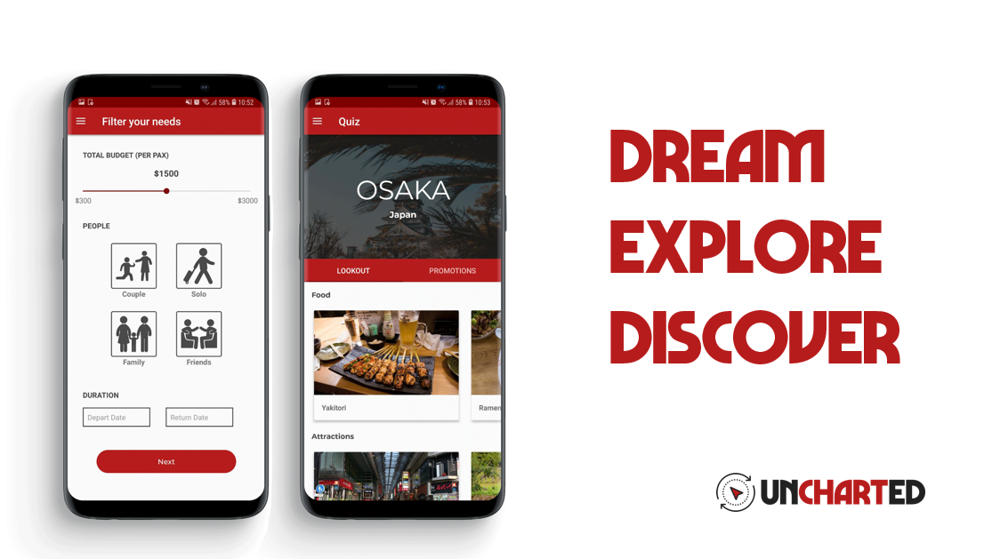

Uncharted
===================================
Uncharted is an Android mobile application that assists users to find their next perfect travel destination. With the help of Uncharted's machine learning algorithm, users just have answer a series of questions that will pinpoint a destination catering to their needs!

Pre-requisites
--------------
- Android SDK 26
- Android Build Tools v26.0.3
- Android Support Repository

Installation
------------
Steps for trying out this sample:
1) Download the Uncharted.apk file onto your mobile phone.
2) Once the Uncharted application is downloaded, register for new profile.
3) Start exploring the app!

Screenshots
-------------

 

App store
------------

Features
------------
- Travel Genie 
will ask you a series of question and based on the selected options and  will decide 
for you a country with a list of food, activities, attractions and not to mention travel packages to help you
with planning for your own itenary.

- Map Scratcher
Based on the list of countries that you have travelled, you can plot them on our customized map layout
of countries you have visited.

- Genie History
Travel Genie lists down countries that he has suggested so you can take a look at the existing activities
and help you plan your trip based on your previous searches

- Profile
You can update your profile and change your dietary needs which will be reflected over when travel genie decides for you a destination to travel to!

